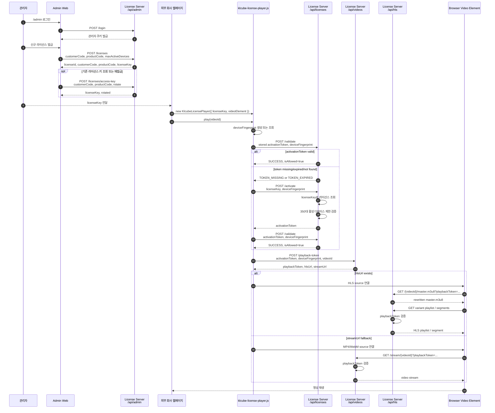
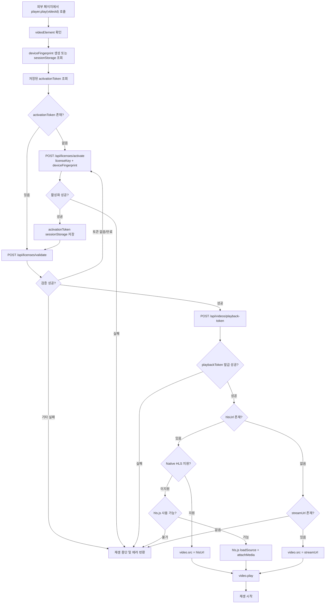
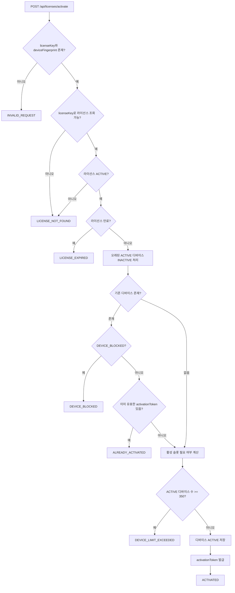
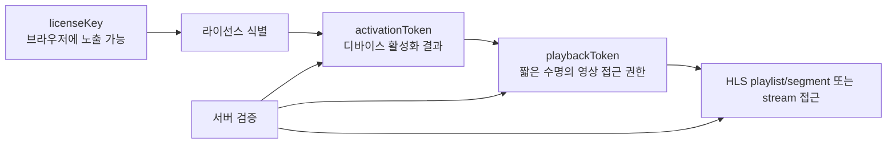

# KLCUBE License Player Flow Diagram

## 1. 전체 절차



## 2. 클라이언트 플레이어 내부 흐름



## 3. 서버 활성화 검증 흐름



## 4. 외부 회사 연동 최소 코드

```html
<script src="https://cdn.jsdelivr.net/npm/hls.js@latest"></script>
<script src="./klcube-license-player.js"></script>

<video id="videoPlayer" controls></video>

<script>
  const player = new KlcubeLicensePlayer({
    serverBaseUrl: "https://license.example.com",
    licenseKey: "KLC-LIC-xxxxxxxxxxxxxxxxxxxxxxxxxxxxxxxx",
    videoElement: "#videoPlayer"
  });

  await player.play("video001");
</script>
```

## 5. 보안 경계



`licenseKey`는 공개 키에 가깝습니다. 최종 접근 제어는 서버의 activation token, playback token, HLS segment 검증, 디바이스 수 제한으로 수행됩니다.
